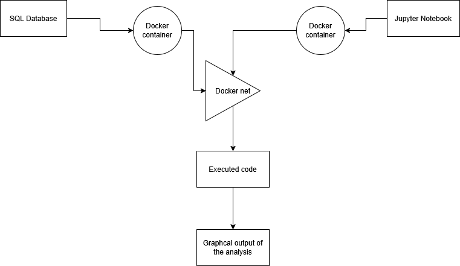

# Introduction
This project is about analysing and understand data from a business to improve its odds in the market. The company requiring this project requires it because it seems to be having revenue issues. For years growth seems to have slowed or even completey stopped, so they need to inform their future decisions based on real data and real analysis. This analysis should hopefully be able to guide their decisions both in which type of clientele they need to focus on and which type of products sell best.

This work was done by analysing the retail data of the shop and understanding what was lacking and what was not. The data was put in an SQL database. We linked the database to the python code through psycopg2 which created the connection we used to connect the code to the docker. We used 2 docker containers one for the database and one for the jupyter notebook that we connected through a docker net. By using pandas and numpy, we read and analysed the database to extract useful information.

# Implementation
## Project Architecture

## Data Analytics and Wrangling
[Notebook](retail_data_analytics_wrangling.ipynb)
With this data the business could better focus on specific customers, such as those in the category "Can't loose" or the "Future loyalist". As those customers could decide the fate of the business, either by stopping to come by or by starting to become more active. 

The business should also focus on getting more new and old customers in the months of January and February, because those seem like slumpy months in terms of sales. 

# Improvements
If I had more time, I would have searche dfor the specific kind of purchases the "Can't loose" and the "Future loyalist" make so that the business can expand their selection in those kinds of products. I would also have made an analysis of what the customers that left or that never came back wanted as products, so to better understand the patterns of arriving and leaving the business, to see what attracted them and what they felt was lacking. Finally, I would I have checked on what the most returned products were, so as to see what the issue could be with them and why they are returned or the orders are cancelled so much.